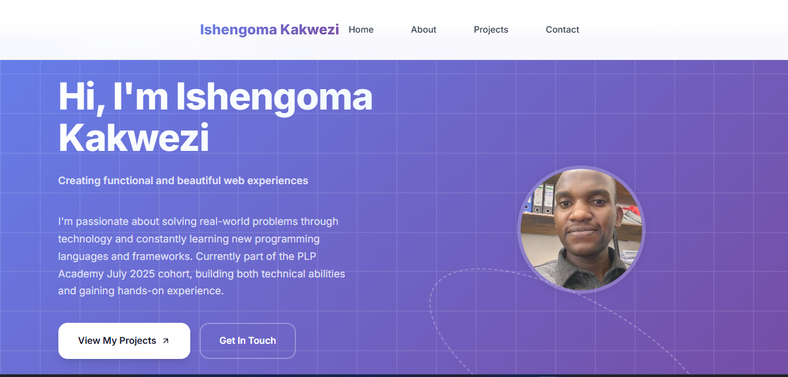
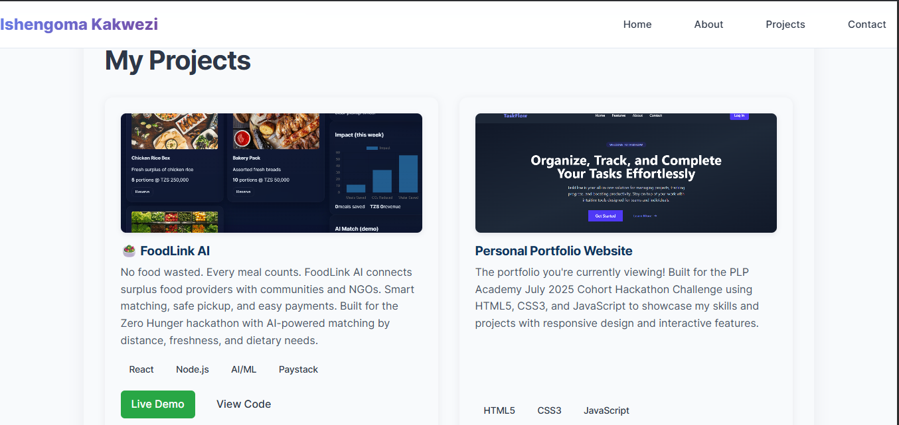
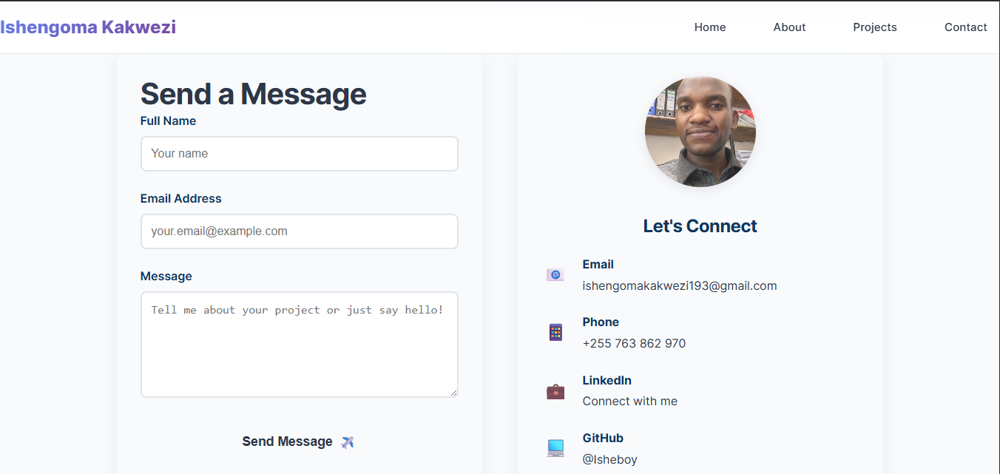
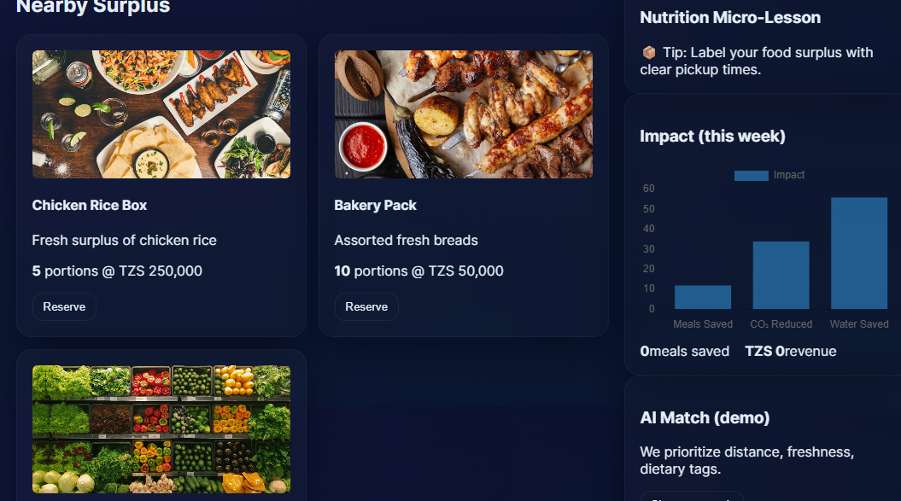

# Ishengoma Kakwezi - Creative Portfolio Website

## Purpose

A modern, responsive portfolio website showcasing my development skills, projects, and professional journey. Features dynamic GitHub integration, modern design inspired by contemporary web applications, and real project showcases including the award-winning FoodLink AI platform.

## Portfolio Screenshots

### Homepage

_Modern hero section with gradient background and professional introduction_

### Projects Page

_Showcase of featured projects including FoodLink AI_

### Contact Page

_Professional contact form with validation and contact information_

## Live Demo

[Live Portfolio](https://ishengomaportfoliowebsite.netlify.app/)

## Structure

- `index.html` — Home (hero section, intro, call-to-action)
- `about.html` — Biography, skills, education, CV download
- `projects.html` — Featured projects + dynamic GitHub repositories
- `contact.html` — Contact form with validation + contact information
- `/css/style.css` — Modern, responsive styling with gradients and animations
- `/js/script.js` — Interactive features, GitHub API integration, form validation
- `/images/` — Project screenshots, profile photos, and assets

## Featured Projects

### 🥗 FoodLink AI

- **Live Demo**: [foodlinkai.netlify.app](https://foodlinkai.netlify.app/)
- **Impact**: 1,240+ meals saved, 14 partners, 7 CSR sponsors
- **Tech Stack**: React, Node.js, AI/ML, Paystack integration
- **Description**: Zero hunger solution connecting surplus food providers with communities

### Personal Portfolio Website

- **Current Project**: This responsive portfolio website
- **Tech Stack**: HTML5, CSS3, JavaScript
- **Features**: Modern design, GitHub integration, responsive layout

## Features

- **Modern Design**: Gradient backgrounds, card layouts, smooth animations
- **Responsive Layout**: Mobile-first design with hamburger navigation
- **Dynamic Content**: GitHub API integration for live repository showcase
- **Interactive Elements**: Hover effects, form validation, scroll animations
- **Project Showcase**: Featured projects with images, stats, and live links
- **Professional Contact**: Enhanced contact form with profile integration

### Visual Design Elements

- 🎨 **Modern Gradients**: Eye-catching color schemes
- 📱 **Mobile Responsive**: Optimized for all devices
- ⚡ **Interactive Animations**: Smooth scroll effects and hover states
- 🔗 **GitHub Integration**: Live repository showcase
- 📋 **Contact Form**: Professional contact with validation

## Technical Implementation

### HTML5 Semantic Structure

- Proper semantic tags (`<header>`, `<nav>`, `<section>`, `<article>`, `<footer>`)
- Accessible form elements with proper labels
- SEO-optimized meta tags and descriptions

### CSS Features

- CSS Grid and Flexbox for responsive layouts
- CSS custom properties for consistent theming
- Smooth transitions and hover animations
- Mobile-responsive navigation with hamburger menu
- Modern gradient backgrounds and card designs

### JavaScript Functionality

- **GitHub API Integration**: Dynamically fetches and displays repositories
- **Image Matching**: Automatically pairs projects with relevant images
- **Form Validation**: Client-side validation with user feedback
- **Mobile Navigation**: Responsive hamburger menu toggle
- **Scroll Animations**: IntersectionObserver for smooth animations

## Design Inspiration

Modern web application aesthetics with clean layouts, engaging hero sections, and professional project showcases. Color scheme and layout inspired by contemporary SaaS platforms for a professional developer presentation.

## Live Demo

[Live Portfolio](https://ishengomaportfoliowebsite.netlify.app/)

## Deployment Instructions

### Deploy to GitHub Pages

1. Push all files to your GitHub repository
2. Go to Settings → Pages
3. Set source to `Deploy from a branch`
4. Select `main` branch and `/ (root)` folder
5. Save and visit the provided URL

### Deploy to Netlify

1. Connect your GitHub repository to [Netlify](https://netlify.com/)
2. Configure build settings (if needed):
   - Build command: `# No build step required`
   - Publish directory: `./`
3. Deploy automatically on every push to main branch

## Performance Optimization

- **Images**: Optimized PNG/JPG images for fast loading
- **Code**: Minified and organized CSS/JS
- **API**: Efficient GitHub API calls with error handling
- **Responsive**: Mobile-optimized layouts and images

## Browser Compatibility

- Modern browsers (Chrome, Firefox, Safari, Edge)
- Mobile responsive design
- Progressive enhancement for older browsers

## Contact & Social Links

- **Email**: ishengomakakwezi193@gmail.com
- **Phone**: +255 763 862 970
- **LinkedIn**: [Ishengoma Kakwezi](https://www.linkedin.com/in/ishengoma-kakwezi-208392342)
- **GitHub**: [@Isheboy](https://github.com/Isheboy)

---

© 2025 Ishengoma Kakwezi. All rights reserved.
